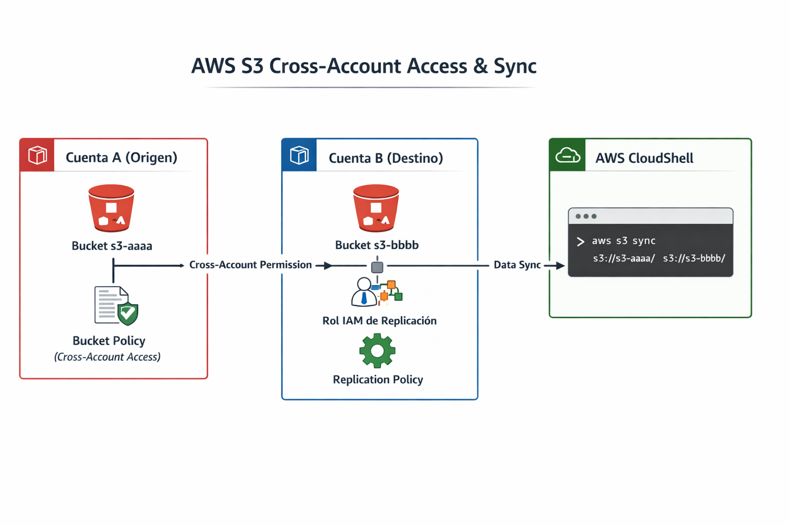

# 🔁 AWS S3 Cross-Account Access & Sync

Acceso entre cuentas AWS y sincronizar objetos entre buckets S3 utilizando IAM, Bucket Policies y AWS CloudShell.

---

## 📖 Descripción

Este proyecto demuestra cómo permitir que una cuenta AWS acceda a un bucket S3 ubicado en otra cuenta, aplicando buenas prácticas de seguridad y el principio de mínimo privilegio.

Se implementa:

- Acceso cross-account mediante Bucket Policy
- Rol IAM para permisos específicos de replicación
- Sincronización de datos con AWS CLI
- Separación de responsabilidades entre cuentas

---

## 🎯 Objetivo

Permitir que una cuenta AWS:

- Liste el bucket origen
- Lea objetos del bucket origen
- Configure permisos controlados de replicación
- Sincronice información entre buckets
---

## 🏗️ Arquitectura
## 🏗️ Diagrama de Arquitectura

<p align="center">
  
</p>

---

# 🧩 Paso 1 – Configurar Bucket Policy (Cuenta Origen)

Ruta en consola:

S3 → Bucket `s3-aaaa` → Permissions → Bucket Policy

Agregar la siguiente política:

```json
{
  "Version": "2012-10-17",
  "Statement": [
    {
      "Sid": "AllowCrossAccountList",
      "Effect": "Allow",
      "Principal": {
        "AWS": "arn:aws:iam::ID_CUENTA_DESTINO:root"
      },
      "Action": [
        "s3:ListBucket"
      ],
      "Resource": "arn:aws:s3:::s3-aaaa"
    },
    {
      "Sid": "AllowCrossAccountRead",
      "Effect": "Allow",
      "Principal": {
        "AWS": "arn:aws:iam::ID_CUENTA_DESTINO:root"
      },
      "Action": [
        "s3:GetObject"
      ],
      "Resource": "arn:aws:s3:::s3-aaaa/*"
    }
  ]
}
]

---

# 🧩 Paso 1 – Configurar Bucket Policy (Cuenta Origen)

Ruta en consola:

S3 → Bucket `s3-aaaa` → Permissions → Bucket Policy

Agregar la siguiente política:

```json
{
  "Version": "2012-10-17",
  "Statement": [
    {
      "Sid": "AllowCrossAccountList",
      "Effect": "Allow",
      "Principal": {
        "AWS": "arn:aws:iam::ID_CUENTA_DESTINO:root"
      },
      "Action": [
        "s3:ListBucket"
      ],
      "Resource": "arn:aws:s3:::s3-aaaa"
    },
    {
      "Sid": "AllowCrossAccountRead",
      "Effect": "Allow",
      "Principal": {
        "AWS": "arn:aws:iam::ID_CUENTA_DESTINO:root"
      },
      "Action": [
        "s3:GetObject"
      ],
      "Resource": "arn:aws:s3:::s3-aaaa/*"
    }
  ]
}
 }
```
✅ Esto permite que la cuenta destino pueda listar y leer objetos del bucket origen.

---

# 🧩 Paso 2 – Crear Rol IAM en la Cuenta Destino

### 📍 Ruta en Consola

IAM → Roles → Create Role

### 🔹 Seleccionar

- Another AWS Account

### 🔹 Adjuntar política personalizada

```json
{
  "Version": "2012-10-17",
  "Statement": [
    {
      "Sid": "AllowReplicationFromSource",
      "Effect": "Allow",
      "Principal": {
        "AWS": "arn:aws:iam::ID_CUENTA_ORIGEN:role/copia-s3-rol"
      },
      "Action": [
        "s3:ReplicateObject",
        "s3:ReplicateDelete",
        "s3:ReplicateTags"
      ],
      "Resource": "arn:aws:s3:::s3-bbbb/*"
    }
  ]
}

```

# 🧩 Paso 3 – Sincronización con AWS CloudShell

### 📍 Procedimiento

1. Ingresar a la **Cuenta Destino**.
2. Abrir **AWS CloudShell** desde la consola.
3. Ejecutar el siguiente comando:

```bash
aws s3 sync s3://s3-aaaa/ s3://s3-bbbb/
